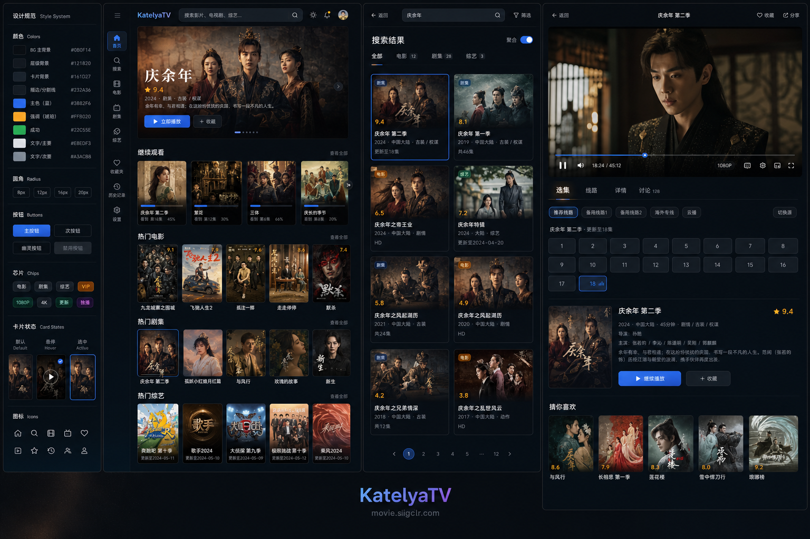
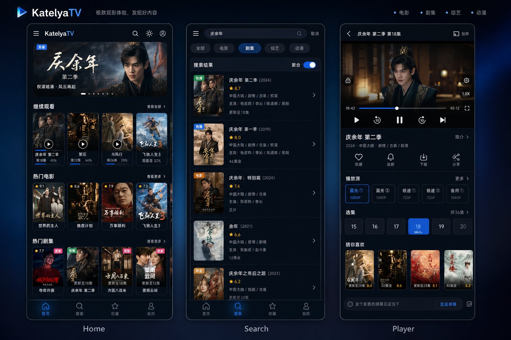
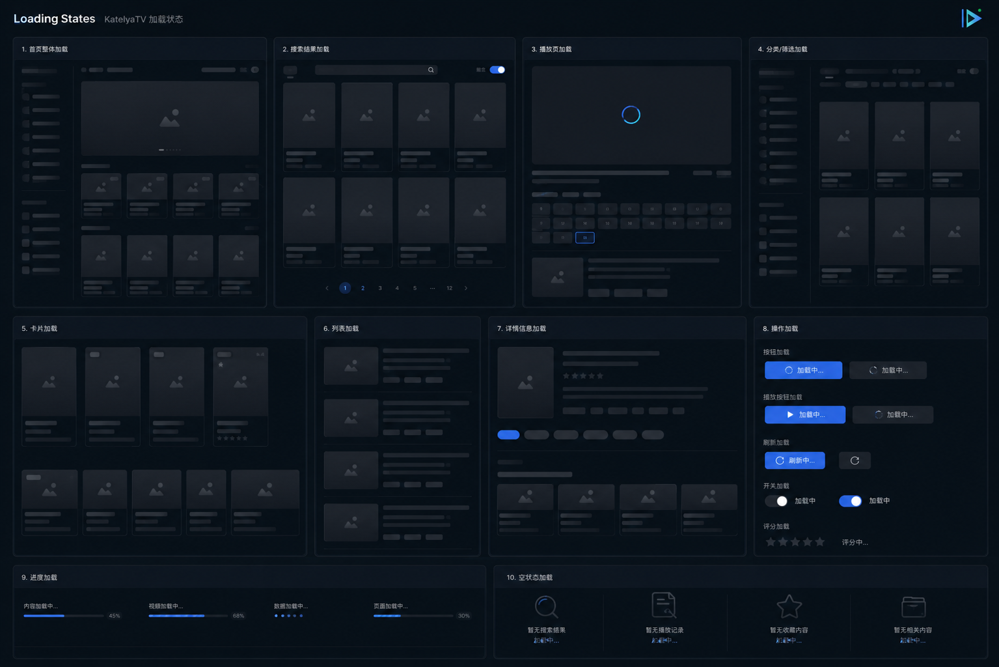

<div align="center">
  

  <h1>KatelyaTV</h1>
  <p><strong>自托管的流媒体聚合平台 &mdash; 跨平台、多源搜索、即开即播</strong></p>
  <p>基于 <code>Next.js 14</code> &middot; <code>TypeScript 4.9</code> &middot; <code>Tailwind CSS 3</code> &middot; ArtPlayer + HLS.js 构建</p>
  <p>MoonTV 社区延续项目 &middot; 持续维护中</p>

  <p>
    <a href="README.md">English</a> |
    <a href="#部署">部署</a> &middot;
    <a href="#功能特性">功能特性</a> &middot;
    <a href="#docker">Docker</a> &middot;
    <a href="#环境变量">环境变量</a>
  </p>
</div>

## 项目来源

本项目来源于 MoonTV，作为社区延续版本进行维护。感谢原作者和贡献者们。目标：更简单的部署、更好的用户体验、持续稳定的维护。

> **注意：** 为了长期稳定性和合规性，内置视频源已被移除。用户需要自行配置源 API。详见[配置文件格式](#源配置)及本文档中的配置链接推荐。

## 功能特性

### 播放体验

- **多源聚合搜索** &mdash; 一次查询搜索所有配置的源
- **AI 找片助手** &mdash; 可选的 OpenAI 兼容模型，将自然语言描述转化为搜索关键词（详见[设计文档](specs/features/2026-05-16-ai-find-assistant.md)）
- **高清播放** &mdash; ArtPlayer + HLS.js，支持多格式播放
- **跳过片头/片尾** &mdash; 自动检测或手动设置跳过片段
- **断点续播** &mdash; 跨设备进度同步（需非本地存储后端）
- **响应式设计** &mdash; 适配手机、平板、桌面端

### 数据管理

- **收藏夹** &mdash; 跨设备同步
- **观看历史** &mdash; 自动记录
- **多用户** &mdash; 独立用户数据
- **多存储后端** &mdash; LocalStorage、Redis、Kvrocks、D1、Upstash

### 安全防护

- **Turnstile 验证** &mdash; Cloudflare Turnstile 人机验证，保护注册
- **注册邀请系统** &mdash; 管理员可创建邀请码，控制用户注册
- **邀请链接** &mdash; 管理端复制邀请码时会生成 `/login?inviteCode=YOUR_CODE`
  链接，打开后自动回填注册页邀请码
- **安全会话** &mdash; httpOnly Cookie + HMAC-SHA256 签名
- **密码哈希** &mdash; PBKDF2-SHA256（100,000 次迭代）

### 体验优化

- **HLS 广告过滤** &mdash; 过滤 HLS 流中的已知广告片段
- **源站评分** &mdash; 自动检测源站健康状态与可用性
- **AI 用量监控** &mdash; 管理后台可追踪 AI 找片助手使用情况

### 部署与集成

- **Docker** &mdash; 一键部署，多架构镜像
- **多平台** &mdash; Vercel、Cloudflare Pages、传统服务器
- **PWA** &mdash; 可安装为桌面/移动端应用
- **TVBox 兼容** &mdash; 标准 JSON 配置端点（详见[设计文档](specs/features/2026-05-01-tvbox-integration.md)）
- **OrionTV** &mdash; Android TV 后端支持
- **深色模式** &mdash; 明暗主题切换
- **管理面板** &mdash; 源管理、用户管理、站点配置

## 截图

<div align="center">
  
  <p><em>Web 界面</em></p>

  
  <p><em>移动端界面</em></p>

  
  <p><em>状态设计</em></p>
</div>

## 技术栈

| 分类      | 技术依赖                                                   |
| --------- | ---------------------------------------------------------- |
| 框架      | Next.js 14 &middot; App Router                             |
| UI 与样式 | Tailwind CSS 3 &middot; Framer Motion &middot; Headless UI |
| 语言      | TypeScript 4.9                                             |
| 播放器    | ArtPlayer &middot; HLS.js                                  |
| 状态管理  | React Hooks &middot; Context API                           |
| 数据校验  | Zod                                                        |
| 认证      | PBKDF2-SHA256 &middot; HMAC-SHA256 &middot; Turnstile      |
| 代码质量  | ESLint &middot; Prettier &middot; Jest &middot; Husky      |
| PWA       | next-pwa                                                   |
| 部署      | Docker &middot; Vercel &middot; Cloudflare Pages           |

## 部署

### 部署方案对比

| 方案             | 难度 | 多用户      | 数据可靠性 | 适用场景             |
| ---------------- | ---- | ----------- | ---------- | -------------------- |
| Docker（单容器） | 简单 | 否          | 中等       | 个人使用，最快速     |
| Docker + Redis   | 中等 | 是          | 高         | 家庭/团队使用        |
| Docker + Kvrocks | 中等 | 是          | 极高       | 生产环境，零数据丢失 |
| Vercel           | 简单 | 否          | 低         | 快速试用，无需服务器 |
| Cloudflare Pages | 高级 | 是（需 D1） | 高         | 技术爱好者           |

---

### Docker（推荐）

#### 单容器部署

```bash
docker pull ghcr.io/katelya77/katelyatv:latest

docker run -d \
  --name katelyatv \
  -p 3000:3000 \
  --env PASSWORD=your_password \
  --restart unless-stopped \
  ghcr.io/katelya77/katelyatv:latest
```

挂载自定义配置：

```bash
docker run -d \
  --name katelyatv \
  -p 3000:3000 \
  --env PASSWORD=your_password \
  -v /path/to/config.json:/app/config.json:ro \
  --restart unless-stopped \
  ghcr.io/katelya77/katelyatv:latest
```

**Windows：** 使用 PowerShell。**访问地址：** `http://localhost:3000` 或 `http://your-server-ip:3000`。

#### Docker Compose（Redis）

```yaml
version: '3.8'

services:
  katelyatv:
    image: ghcr.io/katelya77/katelyatv:latest
    container_name: katelyatv
    ports:
      - '3000:3000'
    environment:
      - USERNAME=admin
      - PASSWORD=your_strong_password
      - NEXT_PUBLIC_STORAGE_TYPE=redis
      - REDIS_URL=redis://katelyatv-redis:6379
      - NEXT_PUBLIC_ENABLE_REGISTER=true
      - AUTH_SIGNING_SECRET=your_random_secret
    depends_on:
      katelyatv-redis:
        condition: service_healthy
    restart: unless-stopped

  katelyatv-redis:
    image: redis:7-alpine
    container_name: katelyatv-redis
    command: redis-server --appendonly yes --maxmemory 256mb --maxmemory-policy allkeys-lru
    volumes:
      - katelyatv-redis-data:/data
    healthcheck:
      test: ['CMD', 'redis-cli', 'ping']
      interval: 10s
      timeout: 3s
      retries: 3
    restart: unless-stopped

volumes:
  katelyatv-redis-data:
```

```bash
# 启动
docker compose up -d

# 检查状态
docker compose ps
docker compose logs -f
```

#### Docker Compose（Kvrocks）

适用于需要高数据可靠性的生产环境（基于 RocksDB 持久化存储）：

```bash
# 下载配置
curl -O https://raw.githubusercontent.com/katelya77/KatelyaTV/main/docker-compose.kvrocks.yml

# 配置环境变量
cp .env.kvrocks.example .env
# 编辑 .env：设置 KVROCKS_PASSWORD、PASSWORD、AUTH_SIGNING_SECRET

# 启动
docker compose -f docker-compose.kvrocks.yml up -d
```

本地构建版本见 `docker-compose.kvrocks.local.yml`。

#### Docker 管理命令

```bash
docker ps                          # 状态查看
docker logs katelyatv              # 日志查看
docker restart katelyatv           # 重启
docker stop katelyatv && docker rm katelyatv  # 停止并删除

# 升级
docker pull ghcr.io/katelya77/katelyatv:latest
# 然后重新执行 docker run 命令

# Compose 升级
docker compose pull && docker compose up -d
```

---

### Vercel

1. Fork 本仓库到 GitHub
2. 在 Vercel 中导入 Fork 的仓库
3. 添加环境变量：`PASSWORD` = 你的密码
4. 部署

> Vercel 部署不支持多用户。数据存储在浏览器 localStorage 中。

---

### Cloudflare Pages

1. Fork 本仓库
2. Cloudflare 控制台：Workers & Pages &rarr; 创建 &rarr; Pages &rarr; 连接 Git
3. 构建设置：
   - **构建命令：** `pnpm install && pnpm pages:build`
   - **输出目录：** `.vercel/output/static`
   - **Node.js 版本：** 18
4. 添加环境变量：`PASSWORD`
5. 添加兼容性标志：`nodejs_compat`

**使用 D1（多用户）：**

1. 在 Cloudflare 控制台创建 D1 数据库
2. 执行 [D1 初始化 SQL](specs/notes/2026-01-01-d1-initialization.md)
3. 在 Pages 项目设置中绑定为 `DB`
4. 添加环境变量：`NEXT_PUBLIC_STORAGE_TYPE=d1`、`USERNAME`、`PASSWORD`、`AUTH_SIGNING_SECRET`
5. 重新部署

增量 D1 迁移详见 [D1 迁移指南](specs/notes/2026-05-09-d1-migration.md)。

---

## 源配置

KatelyaTV 使用标准 Apple CMS V10 API 格式。在项目根目录创建 `config.json`：

```json
{
  "cache_time": 7200,
  "api_site": {
    "example": {
      "api": "https://example.com/api.php/provide/vod",
      "name": "示例源",
      "detail": "https://example.com"
    }
  }
}
```

- `cache_time`：API 缓存时间（秒）
- `api_site`：源定义
  - `key`：唯一小写标识符
  - `api`：VOD JSON API 根地址（Apple CMS V10 格式）
  - `name`：显示名称
  - `detail`：（可选）需要抓取 HTML 的源的详情页地址

推荐配置文件请参见上方部署章节的下载链接。

**管理面板**（仅非 localstorage 模式）：可导入/导出配置、拖拽排序源、按源启用/禁用。修改直接持久化到数据库，无需重启。

> **配置加载说明：** Docker 部署时（`DOCKER_ENV=true`），`config.json` 在运行时从文件系统读取。Vercel/Cloudflare Pages 部署时，配置通过 `scripts/convert-config.js` 在构建时编译为 `src/lib/runtime.ts`。非 localstorage 模式下，数据库中存储的管理配置会覆盖文件配置。

## 环境变量

### 核心配置

| 变量                  | 描述                                                        | 默认值       |
| --------------------- | ----------------------------------------------------------- | ------------ |
| `PASSWORD`            | 站点访问密码（必填）                                        | （空）       |
| `AUTH_SIGNING_SECRET` | 会话 Cookie 的 HMAC-SHA256 签名密钥（非 localstorage 必填） | （空）       |
| `USERNAME`            | 管理员用户名（非 localstorage 模式）                        | （空）       |
| `SITE_NAME`           | 站点显示名称                                                | `KatelyaTV`  |
| `ANNOUNCEMENT`        | 站点公告横幅文字                                            | （免责声明） |
| `DOCKER_ENV`          | Docker 中设为 `true`，在运行时读取 config.json              | （空）       |

### 存储配置

| 变量                          | 描述                              | 可选值                                              | 默认值         |
| ----------------------------- | --------------------------------- | --------------------------------------------------- | -------------- |
| `NEXT_PUBLIC_STORAGE_TYPE`    | 存储后端                          | `localstorage`、`redis`、`kvrocks`、`d1`、`upstash` | `localstorage` |
| `REDIS_URL`                   | Redis 连接地址                    | 连接 URL                                            | （空）         |
| `KVROCKS_URL`                 | Kvrocks 连接地址                  | 连接 URL                                            | （空）         |
| `KVROCKS_PASSWORD`            | Kvrocks 密码                      | 字符串                                              | （空）         |
| `KVROCKS_DATABASE`            | Kvrocks 数据库编号                | `0`-`15`                                            | `0`            |
| `UPSTASH_URL`                 | Upstash Redis URL                 | 连接 URL                                            | （空）         |
| `UPSTASH_TOKEN`               | Upstash Redis Token               | Token 字符串                                        | （空）         |
| `NEXT_PUBLIC_ENABLE_REGISTER` | 允许用户注册（仅非 localstorage） | `true` / `false`                                    | `false`        |

### 搜索与代理

| 变量                          | 描述                      | 默认值 |
| ----------------------------- | ------------------------- | ------ |
| `NEXT_PUBLIC_SEARCH_MAX_PAGE` | 最大搜索页数              | `5`    |
| `NEXT_PUBLIC_IMAGE_PROXY`     | 浏览器端图片代理 URL 前缀 | （空） |
| `NEXT_PUBLIC_DOUBAN_PROXY`    | 浏览器端豆瓣 API 代理 URL | （空） |
| `NEXT_PUBLIC_SOURCE_PROBE`    | 浏览器端源站探测代理      | （空） |
| `NEXT_PUBLIC_HLS_PROXY`       | 浏览器端 HLS 流代理       | （空） |

### Turnstile 与注册安全

| 变量                                   | 描述                          | 默认值  |
| -------------------------------------- | ----------------------------- | ------- |
| `NEXT_PUBLIC_TURNSTILE_SITE_KEY`       | Cloudflare Turnstile 站点密钥 | （空）  |
| `TURNSTILE_SECRET_KEY`                 | Cloudflare Turnstile 密钥     | （空）  |
| `REGISTER_TURNSTILE_REQUIRED`          | 注册时要求 Turnstile 验证     | `false` |
| `NEXT_PUBLIC_REGISTER_INVITE_REQUIRED` | 注册需要邀请码                | `false` |
| `REGISTER_INVITE_REQUIRED`             | 服务端邀请要求                | （空）  |
| `REGISTER_PASSWORD_MIN_LENGTH`         | 密码最小长度                  | `6`     |
| `REGISTER_IP_WINDOW_SECONDS`           | IP 速率限制时间窗口（秒）     | `3600`  |
| `REGISTER_IP_WINDOW_LIMIT`             | 每 IP 每窗口最大注册次数      | `3`     |

### AI 找片助手

| 变量                            | 描述                                    | 默认值                      |
| ------------------------------- | --------------------------------------- | --------------------------- |
| `AI_FIND_ENABLED`               | 启用 AI 找片助手                        | `false`                     |
| `AI_BASE_URL`                   | OpenAI 兼容 API 地址                    | `https://api.openai.com/v1` |
| `AI_API_KEY`                    | 服务端 API Key                          | （空）                      |
| `AI_MODEL`                      | 模型名称                                | （空）                      |
| `AI_FIND_DEBUG`                 | 启用调试日志                            | `false`                     |
| `AI_TEMPERATURE`                | 模型温度（0-2）                         | `0.2`                       |
| `AI_REQUEST_TIMEOUT_MS`         | 请求超时时间                            | `20000`                     |
| `AI_MAX_TOKENS`                 | 最大返回 Token 数                       | `800`                       |
| `AI_THINKING_MODE`              | 思考模式：`auto`、`enabled`、`disabled` | `auto`                      |
| `AI_MAX_RESULTS`                | 最大候选搜索词                          | `5`                         |
| `AI_DAILY_LIMIT_PER_USER`       | 每用户每日用量限制                      | `20`                        |
| `AI_DAILY_LIMIT_PER_IP`         | 每 IP 每日用量限制                      | `60`                        |
| `AI_DAILY_LIMIT_GLOBAL`         | 全局每日用量限制                        | （无限制）                  |
| `AI_GROUP_DAILY_LIMIT_PER_USER` | 批量搜索每用户每日限制                  | `50`                        |
| `AI_GROUP_DAILY_LIMIT_PER_IP`   | 批量搜索每 IP 每日限制                  | `120`                       |
| `AI_GROUP_DAILY_LIMIT_GLOBAL`   | 批量搜索全局每日限制                    | （无限制）                  |
| `AI_CACHE_TTL_SECONDS`          | 搜索缓存 TTL                            | `1800`                      |

### Cloudflare 源站评分

| 变量                                 | 描述                         | 默认值  |
| ------------------------------------ | ---------------------------- | ------- |
| `SOURCE_RANKING_ENABLED`             | 启用源站评分                 | `false` |
| `NEXT_PUBLIC_SOURCE_RANKING_ENABLED` | 向前端公开评分状态           | `false` |
| `SOURCE_RANKING_FALLBACK_TO_LIVE`    | 降级到实时探测               | `true`  |
| `SOURCE_RANKING_CRON_ENABLED`        | 启用定时健康检查             | `false` |
| `SOURCE_RANKING_HAS_D1`              | 覆盖 D1 可用性（仅测试用）   | `false` |
| `CRON_API_TOKEN`                     | `/api/cron` 接口的认证 Token | （空）  |

### 验证部署

部署后，访问 `http://your-domain/api/server-config` 查看生效配置，或在 `/admin` 查看管理面板（非 localstorage 模式）。

## 管理面板

适用于非 localstorage 部署。设置 `USERNAME` 和 `PASSWORD` 以创建站长账户。站长可将其他用户提升为管理员。

访问 `/admin` 可以：

- 管理视频源（添加、编辑、删除、排序、启用/禁用）
- 导入/导出源配置
- 管理用户
- 配置站点设置

## TVBox 兼容性

KatelyaTV 提供标准 TVBox JSON 配置端点：

- `GET /api/tvbox?format=json` &mdash; JSON 格式
- `GET /api/tvbox?format=base64` &mdash; Base64 编码格式
- `GET /api/parse?url=<video_url>` &mdash; 视频 URL 解析

详见 [TVBox 集成设计文档](specs/features/2026-05-01-tvbox-integration.md)。

## Android TV（OrionTV）

可在 Android TV 上配合 [OrionTV](https://github.com/zimplexing/OrionTV) 使用。在 OrionTV 中配置你的 KatelyaTV 部署地址和密码。所有 API 路由已启用 CORS 头。

## 文档

更多详细设计文档、说明和笔记见 [`specs/`](specs/) 目录：

```
specs/
  features/    功能设计文档（按 yyyy-mm-dd 命名）
  notes/       迁移指南、故障排查、安全审查
  research/    架构设计与技术决策
```

核心文档：

- [AI 找片助手](specs/features/2026-05-16-ai-find-assistant.md)
- [Cloudflare 源站评分](specs/features/2026-05-09-cloudflare-source-ranking.md)
- [TVBox 集成](specs/features/2026-05-01-tvbox-integration.md)
- [D1 迁移指南](specs/notes/2026-05-09-d1-migration.md)
- [D1 初始化 SQL](specs/notes/2026-01-01-d1-initialization.md)
- [安全审查（2026-05-11）](specs/notes/2026-05-11-security-review.md)
- [认证安全设计](specs/research/2026-05-11-auth-security-hardening-design.md)
- [部署兼容性](specs/notes/2026-01-01-deployment-compatibility.md)
- [Docker 故障排查](specs/notes/2025-09-03-docker-troubleshooting.md)

## 安全

- **务必设置密码。** 未设置 `PASSWORD` 的实例将公开可访问。
- 非 localstorage 模式下使用 `AUTH_SIGNING_SECRET` 进行会话签名。
- 会话 Cookie 设置为 `httpOnly`，使用 HMAC-SHA256 签名。
- 密码使用 PBKDF2-SHA256（100,000 次迭代）哈希存储。
- 请保持实例私有，不要在公开场合分享 URL。

本项目仅供学习和个人使用。用户需自行遵守当地法律法规。项目开发者不对用户的行为承担任何法律责任。

## 许可证

[MIT](LICENSE) &copy; 2025 KatelyaTV & Contributors

## 致谢

- [ts-nextjs-tailwind-starter](https://github.com/theodorusclarence/ts-nextjs-tailwind-starter) &mdash; 初始脚手架
- [LibreTV](https://github.com/LibreSpark/LibreTV) &mdash; 灵感来源
- [LunaTV (MoonTV)](https://github.com/MoonTechLab/LunaTV) &mdash; 原始项目与社区
- [ArtPlayer](https://github.com/zhw2590582/ArtPlayer) &mdash; Web 视频播放器
- [HLS.js](https://github.com/video-dev/hls.js) &mdash; 浏览器端 HLS 播放
- 所有提供免费视频 API 的贡献者
