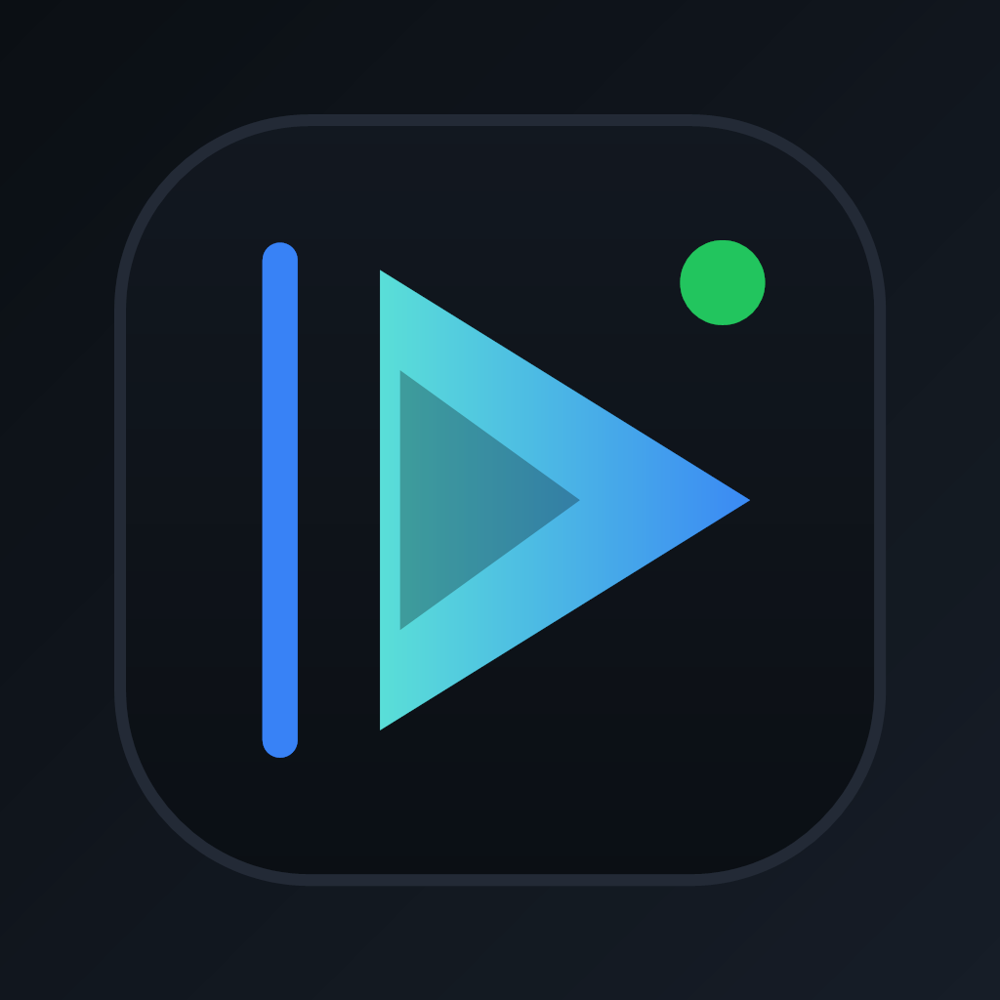

<div align="center">
  

  <h1>KatelyaTV</h1>
  <p><strong>自托管影视聚合播放器 &mdash; 跨平台 &middot; 聚合搜索 &middot; 即开即用</strong></p>
  <p>基于 <code>Next.js 14</code> &middot; <code>TypeScript</code> &middot; <code>Tailwind CSS</code> &middot; ArtPlayer + HLS.js</p>
  <p>MoonTV 二创延续版 &middot; 持续维护与增强</p>

  <p>
    <a href="#部署">部署</a> &middot;
    <a href="#功能特性">功能</a> &middot;
    <a href="#docker">Docker</a> &middot;
    <a href="#环境变量">配置</a>
  </p>
</div>

## 项目来源

本项目自 MoonTV 演进而来，为社区二创继承版本。保留并致谢原作者与社区贡献者。目标：在原作基础上提供更易部署、更友好、更稳定的体验。

> **通知：** 为保障项目长期稳定运行与合规性，已移除内置视频源。用户需自行配置资源站 API。详见[配置文件格式](#视频源配置)及本文档中各处推荐的配置下载链接。

## 功能特性

### 核心播放

- **聚合搜索** &mdash; 一键查询所有已配置的视频源
- **AI 找片助手** &mdash; 可选接入 OpenAI 兼容模型，将自然语言描述转换为可搜索片名（详见[功能文档](specs/features/2026-05-16-ai-find-assistant.md)）
- **高清播放** &mdash; ArtPlayer + HLS.js，支持多种格式和画质
- **跳过片头片尾** &mdash; 自动检测或手动设置跳过时间段
- **断点续播** &mdash; 自动记录播放进度，跨设备同步（非 localstorage 模式）
- **响应式设计** &mdash; 完美适配手机、平板、桌面端

### 数据管理

- **收藏功能** &mdash; 跨设备同步
- **播放历史** &mdash; 自动记录观看历史
- **多用户支持** &mdash; 独立用户数据
- **多存储后端** &mdash; LocalStorage、Redis、Kvrocks、D1、Upstash

### 部署与集成

- **Docker** &mdash; 一键部署，多架构镜像
- **多平台** &mdash; Vercel、Cloudflare Pages、传统服务器
- **PWA** &mdash; 可安装为桌面/手机应用
- **TVBox 兼容** &mdash; 标准 JSON 配置接口（详见[功能文档](specs/features/2026-05-01-tvbox-integration.md)）
- **OrionTV** &mdash; Android TV 后端支持
- **深色模式** &mdash; 明暗主题切换
- **管理后台** &mdash; 视频源管理、用户管理、站点配置

## 技术栈

| 分类     | 主要依赖                                       |
| -------- | ---------------------------------------------- |
| 前端框架 | Next.js 14 &middot; App Router                 |
| UI & 样式 | Tailwind CSS 3 &middot; Framer Motion         |
| 语言     | TypeScript 5                                   |
| 播放器   | ArtPlayer &middot; HLS.js                      |
| 状态管理 | React Hooks &middot; Context API               |
| 代码质量 | ESLint &middot; Prettier &middot; Jest &middot; Husky |
| 部署     | Docker &middot; Vercel &middot; Cloudflare Pages |

## 部署

### 部署方式对比

| 方式              | 难度 | 多用户     | 数据可靠性 | 适用场景           |
| ----------------- | ---- | ---------- | ---------- | ------------------ |
| Docker 单容器     | 简单 | 否         | 中等       | 个人使用，最快速   |
| Docker + Redis    | 中等 | 是         | 高         | 家庭/团队          |
| Docker + Kvrocks  | 中等 | 是         | 极高       | 生产环境，零数据丢失风险 |
| Vercel            | 简单 | 否         | 低         | 快速体验，免服务器 |
| Cloudflare Pages  | 进阶 | 是（需D1） | 高         | 技术爱好者         |

---

### Docker（推荐）

#### 单容器部署

```bash
docker pull ghcr.io/katelya77/katelyatv:latest

docker run -d \
  --name katelyatv \
  -p 3000:3000 \
  --env PASSWORD=你的密码 \
  --restart unless-stopped \
  ghcr.io/katelya77/katelyatv:latest
```

挂载自定义配置：

```bash
docker run -d \
  --name katelyatv \
  -p 3000:3000 \
  --env PASSWORD=你的密码 \
  -v /path/to/config.json:/app/config.json:ro \
  --restart unless-stopped \
  ghcr.io/katelya77/katelyatv:latest
```

**Windows 用户**：在 PowerShell 中运行上述命令。**访问：** `http://localhost:3000` 或 `http://你的服务器IP:3000`。

#### Docker Compose（Redis）

```yaml
version: '3.8'

services:
  katelyatv:
    image: ghcr.io/katelya77/katelyatv:latest
    container_name: katelyatv
    ports:
      - '3000:3000'
    environment:
      - USERNAME=admin
      - PASSWORD=你的强密码
      - NEXT_PUBLIC_STORAGE_TYPE=redis
      - REDIS_URL=redis://katelyatv-redis:6379
      - NEXT_PUBLIC_ENABLE_REGISTER=true
      - AUTH_SIGNING_SECRET=你的随机密钥
    depends_on:
      katelyatv-redis:
        condition: service_healthy
    restart: unless-stopped

  katelyatv-redis:
    image: redis:7-alpine
    container_name: katelyatv-redis
    command: redis-server --appendonly yes --maxmemory 256mb --maxmemory-policy allkeys-lru
    volumes:
      - katelyatv-redis-data:/data
    healthcheck:
      test: ['CMD', 'redis-cli', 'ping']
      interval: 10s
      timeout: 3s
      retries: 3
    restart: unless-stopped

volumes:
  katelyatv-redis-data:
```

```bash
# 启动
docker compose up -d

# 检查状态
docker compose ps
docker compose logs -f
```

#### Docker Compose（Kvrocks）

适用于需要极高数据可靠性的生产环境（基于 RocksDB 持久化存储）：

```bash
# 下载配置文件
curl -O https://raw.githubusercontent.com/katelya77/KatelyaTV/main/docker-compose.kvrocks.yml

# 配置环境变量
cp .env.kvrocks.example .env
# 编辑 .env：设置 KVROCKS_PASSWORD、PASSWORD、AUTH_SIGNING_SECRET

# 启动
docker compose -f docker-compose.kvrocks.yml up -d
```

本地构建版本请使用 `docker-compose.kvrocks.local.yml`。

#### Docker 管理命令

```bash
docker ps                          # 查看状态
docker logs katelyatv              # 查看日志
docker restart katelyatv           # 重启
docker stop katelyatv && docker rm katelyatv  # 停止并删除

# 升级
docker pull ghcr.io/katelya77/katelyatv:latest
# 然后重新运行 docker run 命令

# Compose 升级
docker compose pull && docker compose up -d
```

---

### Vercel

1. 在 GitHub 上 Fork 本仓库
2. 在 Vercel 中导入 Fork 后的仓库
3. 添加环境变量：`PASSWORD` = 你的密码
4. 部署

> Vercel 部署不支持多用户。数据存储在浏览器 localStorage 中。

---

### Cloudflare Pages

1. Fork 本仓库
2. Cloudflare Dashboard：Workers 和 Pages &rarr; 创建 &rarr; Pages &rarr; 连接到 Git
3. 构建设置：
   - **构建命令：** `pnpm install && pnpm pages:build`
   - **输出目录：** `.vercel/output/static`
   - **Node.js 版本：** 18
4. 添加环境变量：`PASSWORD`
5. 添加兼容性标志：`nodejs_compat`

**启用 D1（多用户）：**

1. 在 Cloudflare Dashboard 中创建 D1 数据库
2. 执行 [D1 初始化 SQL](specs/notes/2026-01-01-d1-initialization.md)
3. 在 Pages 项目设置中绑定为 `DB`
4. 添加环境变量：`NEXT_PUBLIC_STORAGE_TYPE=d1`、`USERNAME`、`PASSWORD`、`AUTH_SIGNING_SECRET`
5. 重新部署

D1 增量迁移请参阅 [D1 迁移指南](specs/notes/2026-05-09-d1-migration.md)。

---

## 视频源配置

KatelyaTV 使用标准 Apple CMS V10 API 格式。在项目根目录创建 `config.json`：

```json
{
  "cache_time": 7200,
  "api_site": {
    "example": {
      "api": "https://example.com/api.php/provide/vod",
      "name": "示例资源站",
      "detail": "https://example.com"
    }
  }
}
```

- `cache_time`：接口缓存时间（秒）
- `api_site`：资源站定义
  - `key`：唯一标识，小写字母/数字
  - `api`：VOD JSON API 根地址（Apple CMS V10 格式）
  - `name`：界面显示名称
  - `detail`：（可选）HTML 详情页地址，用于无法通过 API 获取剧集详情的站点

推荐配置文件请见上方各部署章节内的下载链接。

**管理后台**（仅限非 localstorage 模式）：支持导入/导出配置、拖拽排序视频源、启用/禁用。修改实时生效，数据持久化到数据库，无需重启。

## 环境变量

### 核心配置

| 变量                  | 说明                                       | 默认值             |
| --------------------- | ------------------------------------------ | ------------------ |
| `PASSWORD`            | 站点访问密码（必填）                       | （空）             |
| `AUTH_SIGNING_SECRET` | 会话 Cookie 签名密钥（非 localstorage 必填） | （空）             |
| `USERNAME`            | 管理员用户名（非 localstorage 模式）       | （空）             |
| `SITE_NAME`           | 站点显示名称                               | `KatelyaTV`       |
| `ANNOUNCEMENT`        | 站点公告                                   | （免责声明文本）   |

### 存储配置

| 变量                          | 说明                           | 可选值                                               | 默认值          |
| ----------------------------- | ------------------------------ | ---------------------------------------------------- | --------------- |
| `NEXT_PUBLIC_STORAGE_TYPE`    | 存储后端                       | `localstorage`、`redis`、`kvrocks`、`d1`、`upstash` | `localstorage`  |
| `REDIS_URL`                   | Redis 连接 URL                 | 连接 URL                                             | （空）          |
| `KVROCKS_URL`                 | Kvrocks 连接 URL               | 连接 URL                                             | （空）          |
| `KVROCKS_PASSWORD`            | Kvrocks 密码                   | 字符串                                               | （空）          |
| `UPSTASH_URL`                 | Upstash Redis URL              | 连接 URL                                             | （空）          |
| `UPSTASH_TOKEN`               | Upstash Redis Token            | Token 字符串                                         | （空）          |
| `NEXT_PUBLIC_ENABLE_REGISTER` | 是否开放注册（仅非 localstorage） | `true` / `false`                                     | `false`         |
| `NEXT_PUBLIC_TURNSTILE_SITE_KEY` | Cloudflare Turnstile 站点 Key | 字符串                                               | （空）          |
| `TURNSTILE_SECRET_KEY`        | Cloudflare Turnstile 密钥       | 字符串                                               | （空）          |
| `REGISTER_TURNSTILE_REQUIRED` | 注册是否要求人机验证             | `true` / `false`                                     | `true`          |
| `NEXT_PUBLIC_REGISTER_INVITE_REQUIRED` | 前端是否显示邀请码输入 | `true` / `false`                                     | `true`          |
| `REGISTER_INVITE_REQUIRED`    | 注册接口是否要求邀请码           | `true` / `false`                                     | `true`          |
| `REGISTER_PASSWORD_MIN_LENGTH` | 注册密码最短长度                | 数字                                                 | `8`             |
| `REGISTER_IP_WINDOW_SECONDS`  | 注册 IP 频率窗口秒数             | 数字                                                 | `3600`          |
| `REGISTER_IP_WINDOW_LIMIT`    | 同一 IP 在窗口内最多注册次数      | 数字                                                 | `3`             |

### 搜索与代理

| 变量                          | 说明                       | 默认值   |
| ----------------------------- | -------------------------- | -------- |
| `NEXT_PUBLIC_SEARCH_MAX_PAGE` | 搜索最大拉取页数           | `5`      |
| `NEXT_PUBLIC_IMAGE_PROXY`     | 浏览器端图片代理 URL 前缀  | （空）   |
| `NEXT_PUBLIC_DOUBAN_PROXY`    | 浏览器端豆瓣 API 代理前缀  | （空）   |
| `NEXT_PUBLIC_SOURCE_PROBE`    | 浏览器端来源探测代理       | （空）   |
| `NEXT_PUBLIC_HLS_PROXY`       | 浏览器端 HLS 流代理        | （空）   |

### AI 找片助手

| 变量                      | 说明                                   | 默认值                       |
| ------------------------- | -------------------------------------- | ---------------------------- |
| `AI_FIND_ENABLED`         | 是否启用 AI 找片助手                   | `false`                      |
| `AI_BASE_URL`             | OpenAI 兼容 API 地址                   | `https://api.openai.com/v1`  |
| `AI_API_KEY`              | 服务端 API Key                         | （空）                       |
| `AI_MODEL`                | 模型名称                               | （空）                       |
| `AI_FIND_DEBUG`           | 是否输出调试日志                       | `false`                      |
| `AI_TEMPERATURE`          | 模型温度（0-2）                        | `0.2`                        |
| `AI_REQUEST_TIMEOUT_MS`   | 请求超时时间                           | `20000`                      |
| `AI_MAX_TOKENS`           | 最大返回 Token 数                      | `800`                        |
| `AI_THINKING_MODE`        | 思考模式：`auto`、`enabled`、`disabled` | `auto`                      |
| `AI_MAX_RESULTS`          | 最大候选搜索词数                       | `5`                          |
| `AI_DAILY_LIMIT_PER_USER` | 每用户每日使用上限                     | `20`                         |
| `AI_DAILY_LIMIT_PER_IP`   | 每 IP 每日使用上限                     | `60`                         |
| `AI_DAILY_LIMIT_GLOBAL`   | 全站每日使用上限                       | `500`                        |
| `AI_GROUP_DAILY_LIMIT_PER_USER` | 每用户每日候选分组查询上限       | `100`                        |
| `AI_GROUP_DAILY_LIMIT_PER_IP`   | 每 IP 每日候选分组查询上限       | `300`                        |
| `AI_GROUP_DAILY_LIMIT_GLOBAL`   | 全站每日候选分组查询上限         | `2500`                       |
| `AI_CACHE_TTL_SECONDS`    | 搜索缓存时间                           | `1800`                       |

### Cloudflare 播放源优选

| 变量                                 | 说明                               | 默认值   |
| ------------------------------------ | ---------------------------------- | -------- |
| `SOURCE_RANKING_ENABLED`             | 是否启用播放源优选                 | `false`  |
| `NEXT_PUBLIC_SOURCE_RANKING_ENABLED` | 是否向前端暴露启用状态             | `false`  |
| `SOURCE_RANKING_FALLBACK_TO_LIVE`    | D1 无数据时是否回退到实时探测      | `true`   |
| `SOURCE_RANKING_CRON_ENABLED`        | 是否启用定时体检                   | `false`  |
| `SOURCE_RANKING_HAS_D1`              | 手动标记 D1 可用（仅测试环境）     | `false`  |
| `CRON_API_TOKEN`                     | `/api/cron` 接口的鉴权 Token       | （空）   |

### 配置验证

部署后可通过 `http://你的域名/api/server-config` 验证环境变量是否生效，或使用管理员账号登录后访问 `/admin` 管理面板（非 localstorage 模式）。

## 管理后台

适用于非 localstorage 部署。设置 `USERNAME` 和 `PASSWORD` 即可创建站长账号。站长可将其他用户提升为管理员。

访问 `/admin` 可以：
- 管理视频源（增删改、拖拽排序、启用/禁用）
- 导入/导出视频源配置
- 管理用户
- 配置站点设置

## TVBox 兼容

KatelyaTV 提供标准 TVBox JSON 配置接口：

- `GET /api/tvbox?format=json` &mdash; JSON 格式
- `GET /api/tvbox?format=base64` &mdash; Base64 编码格式
- `GET /api/parse?url=<视频地址>` &mdash; 视频解析

详见 [TVBox 集成文档](specs/features/2026-05-01-tvbox-integration.md)。

## Android TV（OrionTV）

可配合 [OrionTV](https://github.com/zimplexing/OrionTV) 在 Android TV 上使用。在 OrionTV 中填入 KatelyaTV 部署地址和密码即可。所有 API 路由均已启用 CORS 跨域支持。

## 项目文档

详细的功能文档、笔记和设计文档位于 [`specs/`](specs/) 目录：

```
specs/
  features/    功能文档（yyyy-mm-dd 日期前缀命名）
  notes/       迁移指南、部署说明、安全审查
  research/    设计文档与架构决策
```

核心文档：

- [AI 找片助手](specs/features/2026-05-16-ai-find-assistant.md)
- [Cloudflare 播放源优选](specs/features/2026-05-09-cloudflare-source-ranking.md)
- [TVBox 集成](specs/features/2026-05-01-tvbox-integration.md)
- [D1 迁移指南](specs/notes/2026-05-09-d1-migration.md)
- [D1 初始化 SQL](specs/notes/2026-01-01-d1-initialization.md)
- [安全审查 (2026-05-11)](specs/notes/2026-05-11-security-review.md)
- [认证安全设计](specs/research/2026-05-11-auth-security-hardening-design.md)

## 安全提醒

- **务必设置密码**。未设置 `PASSWORD` 的实例任何人都可以公开访问。
- 非 localstorage 模式请配置 `AUTH_SIGNING_SECRET` 用于会话签名。
- 会话 Cookie 为 `httpOnly`，使用 HMAC-SHA256 签名。
- 用户密码使用 PBKDF2-SHA256（120,000 次迭代）哈希存储。
- 请勿公开分享你的实例链接。

本项目仅供学习交流和个人使用。使用者需自行确保符合当地法律法规。项目开发者不对用户的使用行为承担任何法律责任。

## 开源协议

[MIT](LICENSE) &copy; 2025 KatelyaTV & Contributors

## 致谢

- [ts-nextjs-tailwind-starter](https://github.com/theodorusclarence/ts-nextjs-tailwind-starter) &mdash; 项目原始脚手架
- [LibreTV](https://github.com/LibreSpark/LibreTV) &mdash; 灵感来源
- [LunaTV（原 MoonTV）](https://github.com/MoonTechLab/LunaTV) &mdash; 原始项目与作者社区
- [ArtPlayer](https://github.com/zhw2590582/ArtPlayer) &mdash; 网页视频播放器
- [HLS.js](https://github.com/video-dev/hls.js) &mdash; 浏览器端 HLS 播放支持
- 所有提供免费影视接口的站点
