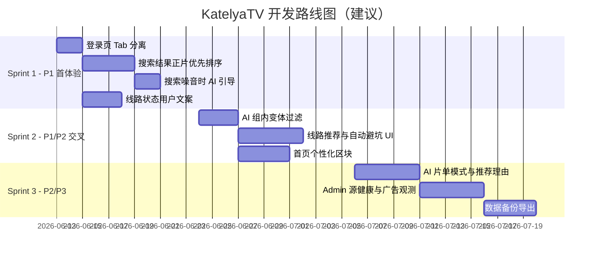

# KatelyaTV 功能开发任务清单

> **关联文档：** [下一步开发方向分层](./2026-06-12-katelyatv-next-development-priorities.md)（战略层 P0–P3 定义）  
> **本文档定位：** 执行层任务卡——结合 2026-06-12 线上实测 + 代码核对后的完成度、优先级与 Sprint 建议。  
> **实测环境：** `https://6285a24c.katelyatv-b3u.pages.dev`（账号 `test` / `Galaxy123`）

---

## 总体判断

**P0 已基本达标**：登录、找片、播放、换源、进度保存闭环可用。实测从继续观看进入《鬼灭之刃》，视频可加载时长（约 23:39）并持续播放。

**下一步重心在 P1**：降低首次体验摩擦、提升搜索/AI 可信度、把线路状态产品化。与战略文档结论一致。

---

## P0 · 维持稳定（已基本完成，少量加固）

| ID | 功能项 | 状态 | 说明 / 建议动作 |
|----|--------|------|----------------|
| P0-1 | 登录 / 注册 / 邀请码 / 会话隔离 | ✅ 已完成 | D1 + Turnstile + 邀请码；维持回归即可 |
| P0-2 | 首页 → 搜索 → 播放闭环 | ✅ 已完成 | 线上实测通过 |
| P0-3 | HLS 播放、选集、进度、收藏 | ✅ 已完成 | ArtPlayer + HLS.js；实测通过 |
| P0-4 | 线路探测、坏源禁用、手动换源 | ✅ 已完成 | `source-preference`、`source-probe`、播放页 20+ 线路 |
| P0-5 | D1 / API / Pages 部署一致性 | ✅ 已完成 | 线上 D1 模式运行正常 |
| P0-6 | 普通用户不进入死路 | ⚠️ 部分 | 存在 `douban.com/subject/undefined` 等坏链；需排查 admin 入口对非管理员可见性 |

**P0 验收：** ✅ 继续观看 →《鬼灭之刃》→ 可播放。

---

## P1 · 首次体验（当前最高 ROI）

| ID | 功能项 | 状态 | 实测 / 代码证据 | 优先级 |
|----|--------|------|----------------|--------|
| P1-1 | 登录页减摩擦：登录与注册视觉分离 | ❌ 未做 | 登录页同屏展示邀请码 + Turnstile，易误解「登录也要邀请码」 | **最高** |
| P1-2 | 搜索结果可信化（正片优先） | ❌ 未做 | 搜「鬼灭之刃」54 条；首屏为无限城篇/解说/国语版；26 集正片靠后。排序仅「标题包含 + 年份」（`src/app/search/page.tsx`） | **最高** |
| P1-3 | AI 找片入口前置 | ⚠️ 半成品 | 有 Tab，但结果噪音大时无引导；`?mode=ai` 不自动切 Tab；搜索词不预填 AI 输入框 | **高** |
| P1-4 | AI 结果组内二次校验 | ❌ 未做 | `aggregateSearchResults` 不过滤解说/剧场版/同名噪音 | **高** |
| P1-5 | 播放页线路文案产品化 | ⚠️ 半成品 | 有 `getSourceStatusLabel`；线上仍大量「待检测」「正在检测浏览器直连能力…」 | **高** |
| P1-6 | 首次播放体验（加载/失败/恢复） | ⚠️ 半成品 | 有「播放准备中」四步进度；失败态仍可能暴露技术 reason | **中** |
| P1-7 | 移动端主路径顺畅 | ⚠️ 半成品 | `MobileBottomNav` 已有；播放页选集/线路在 390px 可用，横屏/触控/遮挡未专门优化 | **中** |

### P1 任务卡（Sprint 1 建议）

#### P1-1 登录页 Tab 分离

- **目标：** 登录只需用户名 + 密码；注册单独 Tab 展示邀请码与 Turnstile。
- **主要文件：** `src/app/login/page.tsx`
- **验收：** 新用户打开登录页，不填写邀请码即可完成登录；注册 Tab 才出现 Turnstile。
- **估时：** 1–2 天

#### P1-2 搜索正片优先排序

- **目标：** 搜「鬼灭之刃」时，26 集 TV 正片组置顶；降权解说、国语版、剧场版、预告片。
- **主要文件：** 新建 `src/lib/search-result-ranking.ts`；`src/app/search/page.tsx` 聚合排序接入
- **规则建议：**
  - 降权关键词：`[电影解说]`、`国语版`、`剧场版`、`预告片`、`短剧`
  - 加分：标题与查询词完全一致、集数多（TV 主季）、豆瓣 id 有效
- **验收：** P1 验收场景通过——正片/主季优先于剧场版、解说、国语版。
- **估时：** 3–4 天

#### P1-3 搜索噪音 → AI 引导

- **目标：** 结果 >30 条或噪音分超阈值时，展示「用 AI 精准找片」；一键带入当前关键词；支持 `?mode=ai` 自动切 Tab。
- **主要文件：** `src/app/search/page.tsx`、`src/components/AiFindPanel.tsx`
- **验收：** 搜「鬼灭之刃」出现引导 Banner；点击后 AI 输入框已填关键词且处于 AI 模式。
- **估时：** 2 天

#### P1-4 AI 组内变体过滤

- **目标：** 候选片名正确后，组内过滤明显不相关条目（解说、剧场版、错误同名）。
- **主要文件：** `src/lib/ai-find/tools/search-katelya-sources.ts`（`aggregateSearchResults` 前后）
- **验收：** AI 找片「鬼灭之刃 TV 第一季」结果组内无解说/剧场版占首屏。
- **估时：** 2–3 天

#### P1-5 线路状态用户文案

- **目标：** `direct`→「推荐·直连」；`proxy`→「备用·需代理」；`unavailable`→「不可用」；隐藏 `403/404/aborted` 原始错误。
- **主要文件：** `src/lib/utils.ts`（`getSourceStatusLabel`）、`src/components/EpisodeSelector.tsx`
- **验收：** 线路 Tab 不再以「待检测」为主文案；用户能区分推荐与不可用。
- **估时：** 2–3 天

#### P1-6 / P1-7（可并入 Sprint 1 或 Sprint 2）

- 播放失败态统一 Toast +「换源」CTA（`src/app/play/page.tsx`）
- 移动端播放页：线路面板默认折叠、选集触控热区 ≥44px（`EpisodeSelector`、播放页布局）

---

## P2 · 差异化与留存

| ID | 功能项 | 状态 | 说明 | 优先级 |
|----|--------|------|------|--------|
| P2-1 | 源优选闭环产品化 | ⚠️ 后端 ✅ / 前端 ❌ | D1 排名、`source-preference`、`source-feedback` 已有；UI 未呈现「推荐 / 自动避坑」 | **最高** |
| P2-2 | AI 找片辨识度 | ⚠️ 基础版 ✅ | 候选片名、历史快照、播放探测已有；缺「按偏好找片单」、推荐理由、失败候选补全 | **高** |
| P2-3 | 个性化首页 | ❌ 未做 | 仅有继续观看 + 豆瓣热门 + 收藏；无「可能想看 / 最近找过」 | **高** |
| P2-4 | 播放质量标签 | ⚠️ 数据 ✅ / UI ❌ | `qualityLabel`、`speedLabel`、`rankScore` 在 API 层已有 | **中** |
| P2-5 | 广告过滤可观测（Admin） | ⚠️ 过滤 ✅ / 面板 ❌ | `hls-ad-filter` 已实现；仅日志，无 Admin 样本页 | **中** |
| P2-6 | 搜索与 AI 自动联动 | ❌ 未做 | 与 P1-3 重叠，P2 阶段可改为智能默认行为 | **中** |
| P2-7 | PWA / 移动体验强化 | ⚠️ 基础 ✅ | `next-pwa` 已有；缺安装引导、后台恢复、投屏 | **低** |

### P2 任务卡（Sprint 2–3 建议）

#### P2-1 线路推荐与自动避坑 UI

- **目标：** 播放页默认选 D1 推荐源；播放失败自动切备用并上报 `source-feedback`。
- **主要文件：** `src/app/play/page.tsx`、`src/lib/source-preference-client.ts`、`src/lib/source-selection.ts`
- **验收：** P2 验收场景——线路面板明确「推荐当前源 / 备用可用 / 不可用」。
- **估时：** 5 天

#### P2-3 首页个性化区块

- **目标：** 「最近 AI 找片」「搜索历史快捷入口」；后续扩展「可能想看」。
- **主要文件：** 首页组件、`src/lib/ai-find/history-client.ts`、`src/lib/db.client.ts`
- **估时：** 4 天

#### P2-2 AI 双模式 + 推荐理由

- **目标：** 「找某部片」与「按偏好找片单」；每条候选展示 reason 字段。
- **主要文件：** `src/components/AiFindPanel.tsx`、`src/app/api/ai/find/`、`src/lib/ai-find/`
- **估时：** 5 天

#### P2-5 Admin 广告命中观测

- **目标：** 管理员只读页：疑似广告片段、命中规则、待验证样本。
- **主要文件：** 新建 Admin 子页；复用 `M3U8AdFilterDebugInfo` 结构
- **估时：** 5 天

---

## P3 · 长期运营与商业化

| ID | 功能项 | 状态 | 优先级 |
|----|--------|------|--------|
| P3-1 | 家庭 / 小团队空间 | ❌ 未做 | 低（私人播放器定位可后置） |
| P3-2 | 高级 AI 权益 | ❌ 未做 | 低 |
| P3-3 | 追更与通知 | ❌ 未做 | 低 |
| P3-4 | 成熟运营后台 | ⚠️ 部分 | 中（AI 用量已有；缺源健康、播放失败率、活跃/转化） |
| P3-5 | 数据导入导出 / 备份 | ❌ 未做 | 中 |
| P3-6 | 付费 / 赞助体系 | ❌ 未做 | 低 |
| P3-7 | 安全与合规成熟化 | ⚠️ 部分 | 中（注册 audit、AI rate limit 已有；缺完整审计与隐私页） |

---

## 验收场景对照（2026-06-12 实测）

| 层级 | 场景 | 结果 |
|------|------|------|
| P0 | 继续观看 →《鬼灭之刃》可播放 | ✅ 通过 |
| P1 | 搜「鬼灭之刃」正片优先 | ❌ 未通过 |
| P1 | 登录页不误解需邀请码 | ❌ 未通过 |
| P2 | 线路面板推荐/备用/不可用 | ❌ 未通过 |
| P3 | 家庭空间 / 追更 / 运营仪表盘 | ❌ 未实现 |

---

## 建议 Sprint 路线图

### Sprint 1 推荐顺序（可并行 2 人）

1. P1-1 登录 Tab 分离  
2. P1-2 搜索正片排序（与 P1-1 可并行）  
3. P1-3 搜索 → AI 引导  
4. P1-5 线路文案（可与 P1-2 并行）

---

## 状态图例

| 符号 | 含义 |
|------|------|
| ✅ 已完成 | 线上或代码已满足战略文档要求 |
| ⚠️ 半成品 | 后端或基础能力已有，产品层未闭环 |
| ❌ 未做 | 尚未实现或实测未通过 |

---

## 修订记录

| 日期 | 说明 |
|------|------|
| 2026-06-12 | 初版：Chrome DevTools 线上实测 + 代码库核对 |
